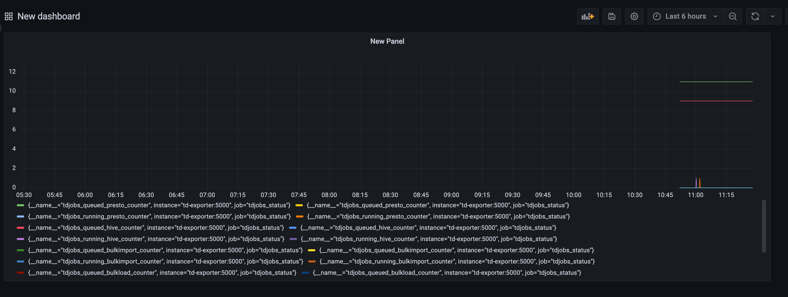

td_exporter
===

td_exporter is an unofficial Prometheus Exporter for Treasure Data  
With this exporter, you can check the current running jobs 

### How to use

1. Download files
    ```
    git clone git@github.com:mickeey2525/td_exporter.git
    cd td_exporter
    ```

2. Build the file
    ```
    go build 
    ```

3. Run the command
    ```
    chmod +x td_exporer
    ./td_exporter -td-apikey Your_APIKEY -endpoint yourEndpoint
    ```

4. Then you can see metrics page at http://localhost:5000/metrics

### How to use with Dockerfile

```bash
docker build -t td-exporter .
docker run -p 5000:5000 td-exporter -e TD_API_KEY your_api_key -e TD_API_HOST your_api_endpoint
```

### How to use docker-compose

1. Run compose file

```bash
docker compose up
```

2. Go to http://localhost:3000

3. And setup your Grafana dashboard



### Metrics

Documents about exposed Prometheus Metrics.  

|Name|Exposed Information|
|---|---|
|tdjobs_queued_bulkload_counter|the number of queued bulkload jobs. This means some jobs wait for resource release|
|tdjobs_running_bulkload_counter|the number of the current running bulk load jobs.|
|tdjobs_queued_bulkimport_counter|the number of queued bulkimport jobs. This means some jobs wait for resource release|
|tdjobs_running_bulkimport_counter|the number of the current running bulkimport jobs.|
|tdjobs_queued_hive_counter|the number of queued hive jobs. This means some jobs wait for resource release|
|tdjobs_running_hive_counter|the number of the current running hive jobs.|
|tdjobs_queued_presto_counter|the number of queued presto jobs. This means some jobs wait for resource release|
|tdjobs_running_prest_counter|the number of the current running presto jobs.|
|tdjobs_queued_resultexport_counter|the number of queued resultexport jobs. This means some jobs wait for resource release|
|tdjobs_running_resultexport_counter|the number of the current running result export jobs.|

